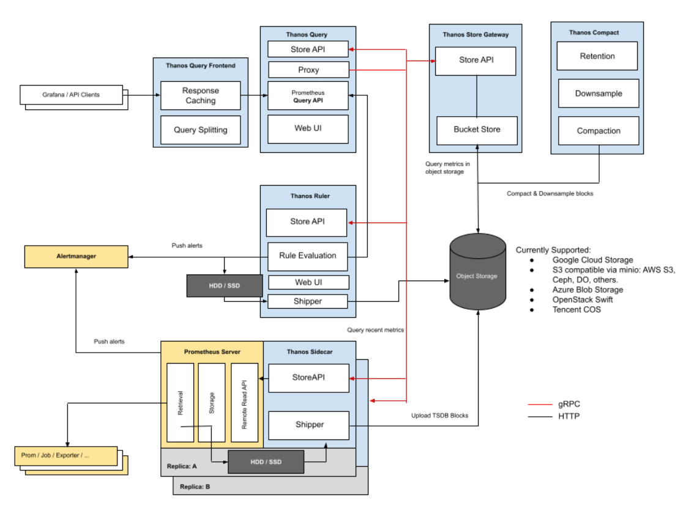
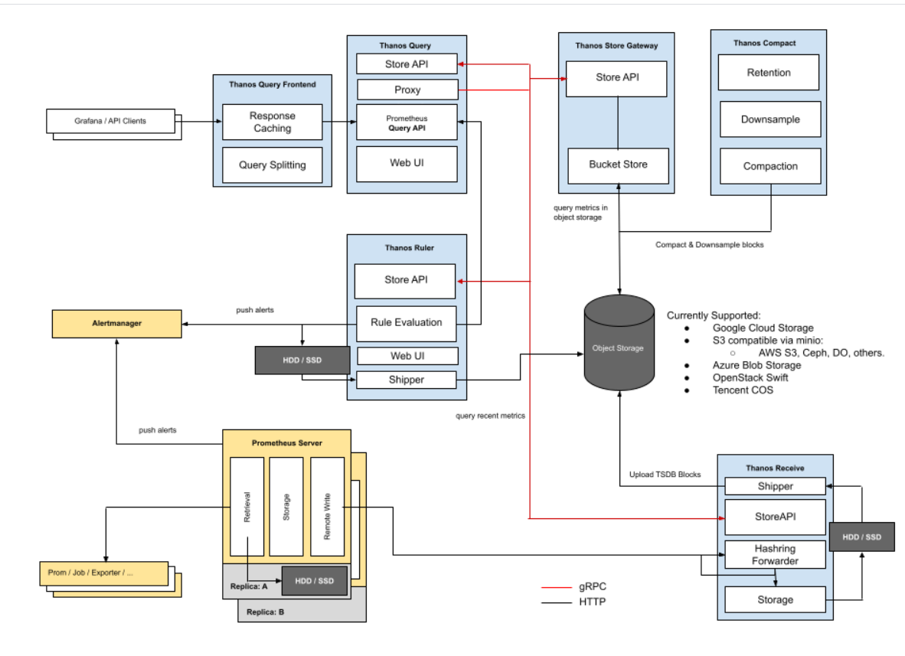

# 本节重点介绍 :
- 核心优点
    - 无需维护存储，存储高可用： 利用廉价的公有云对象存储，高可用
    - 长时间存储，数据降采样：利用Compactor降采样
    - 完全适配原生prometheus查询接口：Query实现
    - 多级数据缓存配置
- 二进制部署


# thanos简介
- [项目地址](https://github.com/thanos-io/thanos)
- [文档地址](https://thanos.io/)

## 组件简介
- Sidecar：连接到 Prometheus，读取其数据进行查询和/或将其上传到云存储。
- Store Gateway：在云存储桶内提供指标
- Compactor：对存储在云存储桶中的数据进行压缩、下采样和 清理过期数据
- Receiver： 从 Prometheus  的WAL接收远程写入数据，将其公开和/或将其上传到云存储
- Ruler/Rule:  针对Thanos 中的数据 进行告警或预聚合工作，进行展示和/或上传
- Querier/Query: 实现 Prometheus 的 v1 API 来聚合来自底层组件的数据
- Query Frontend：实现 Prometheus 的 v1 API，将其代理到 Query，同时缓存响应并按查询日进行可选拆分


## 架构图
- sidecar形式部署

- receiver形式部署


## 核心优点
- 无需维护存储，存储高可用： 利用廉价的公有云对象存储，高可用
- 长时间存储，数据降采样：利用Compactor降采样
- 完全适配原生prometheus查询接口：Query实现
- 多级数据缓存配置


# 部署thanos
- 下载 thanos 
```shell script
wget https://github.com/thanos-io/thanos/releases/download/v0.22.0/thanos-0.22.0.linux-amd64.tar.gz

```
## 步骤1 部署prometheus
### 关闭Prometheus采集器的本地数据压实 
- 使用sidecar模式时，需要关闭Prometheus采集器的本地数据压实
- 对应参数为
    - --storage.tsdb.min-block-duration=2h
    - --storage.tsdb.max-block-duration=2h
    
### sidecar启动的时候也会check
- 对应请求的是 prometheus的 /api/v1/status/flags接口获取其启动的命令行参数
- 检查 storage.tsdb.min-block-duration是否设置是2h
- 如果参数配置错误sidecar启动失败


### 准备prometheus 数据目录等

### prometheus需要设置external_label 
- 原因如下：https://thanos.io/tip/thanos/storage.md/#external-labels
```yaml
global:
  external_labels:
    role: p_for_thanos
```


### 准备prometheus service 文件
```shell script
cat <<EOF >/etc/systemd/system/prometheus_for_thanos.service
[Unit]
Description="prometheus"
Documentation=https://prometheus.io/
After=network.target

[Service]
Type=simple
ExecStart=/opt/app/prometheus_for_thanos/prometheus  --config.file=/opt/app/prometheus_for_thanos/prometheus.yml --storage.tsdb.path=/opt/app/prometheus_for_thanos/data --web.enable-lifecycle --storage.tsdb.min-block-duration=2h  --storage.tsdb.max-block-duration=2h   --web.listen-address=0.0.0.0:7090

Restart=on-failure
RestartSecs=5s
SuccessExitStatus=0
LimitNOFILE=655360
StandardOutput=syslog
StandardError=syslog
SyslogIdentifier=prometheus_for_thanos


[Install]
WantedBy=multi-user.target
EOF

systemctl daemon-reload
systemctl restart prometheus_for_thanos
```

## 步骤2 部署thanos-sidecar
### 使用本地存储测试充当对象存储
- 准备目录和bucket配置文件
```shell script
mkdir -pv /opt/app/thanos/data
cat <<EOF > /opt/app/thanos/local_filesystem_bucket.yml
type: FILESYSTEM
config:
  directory: /opt/app/thanos/data
EOF
```
- 将thanos二进制拷贝到/opt/app/thanos/下

### 准service文件
- --tsdb.path 代表prometheus的data存储目录 
- --prometheus.url 代表prometheus的 地址 
- --objstore.config-file 指定使用哪个对象存储配置文件
- --grpc-address 指定grpc listen 的地址 默认 10901
- --http-address  指定http listen 的地址 默认 10902
```shell script
cat <<EOF> /etc/systemd/system/thanos_sidecar.service
[Unit]
Description="thanos_sidecar"
Documentation=https://prometheus.io/
After=network.target

[Service]
Type=simple
ExecStart=/opt/app/thanos/thanos sidecar --tsdb.path=/opt/app/prometheus_for_thanos/data/ --prometheus.url=http://localhost:7090   --objstore.config-file=/opt/app/thanos/local_filesystem_bucket.yml


Restart=on-failure
RestartSecs=5s
SuccessExitStatus=0
LimitNOFILE=65536
StandardOutput=syslog
StandardError=syslog
SyslogIdentifier=thanos_sidecar


[Install]
WantedBy=multi-user.target
EOF

systemctl daemon-reload
systemctl restart thanos_sidecar

```

### 检查 本地对象存储目录
```shell script
[root@k8s-master01 data]# du -sh /opt/app/prometheus/data 
289M	/opt/app/prometheus/data
[root@k8s-master01 data]# du -sh /opt/app/thanos/data
263M	/opt/app/thanos/data
[root@k8s-master01 data]# 

```

> 上传旧指标  `--shipper.upload-compacted`
- 当 sidecar 使用该--shipper.upload-compacted标志运行时
- 它将在启动时同步来自 Prometheus 本地存储的所有旧的现有块
- 注意：这假设您从未针对此存储桶运行带有块上传的 sidecar
- 否则需要手动步骤从存储桶中删除重叠的块。这些将由 sidecar 验证过程建议。
- 第一次开启后可以看看到sidercar本地数据量和prometheus本地数据量差不多


## 步骤3 部署thanos-store

### 准备service文件
- --data-dir=/var/thanos/store  代表缓存对象存储中的block元信息和索引的目录，不需要设置很大
- --objstore.config-file=/opt/app/thanos/local_filesystem_bucket.yml  代表使用哪个对象存储配置
- --grpc-address=0.0.0.0:10903 因为跟sidecar部署在一台机器上所以 在10901上地址即可   
- --http-address=0.0.0.0:10904 

```shell script
cat  <<EOF > /etc/systemd/system/thanos_store.service
[Unit]
Description="thanos_store"
Documentation=https://prometheus.io/
After=network.target

[Service]
Type=simple
ExecStart=/opt/app/thanos/thanos store --data-dir=/var/thanos/store --objstore.config-file=/opt/app/thanos/local_filesystem_bucket.yml  --grpc-address=0.0.0.0:10903    --http-address=0.0.0.0:10904 

Restart=on-failure
RestartSecs=5s
SuccessExitStatus=0
LimitNOFILE=65536
StandardOutput=syslog
StandardError=syslog
SyslogIdentifier=thanos_store


[Install]
WantedBy=multi-user.target
EOF

systemctl daemon-reload
systemctl restart thanos_store

```

## 步骤4 部署thanos-compactor
### 准备service文件
```shell script
cat  <<EOF > /etc/systemd/system/thanos_compact.service
[Unit]
Description="thanos_compact"
Documentation=https://prometheus.io/
After=network.target

[Service]
Type=simple
ExecStart=/opt/app/thanos/thanos compact --data-dir=/var/thanos/compact --objstore.config-file=/opt/app/thanos/local_filesystem_bucket.yml  --http-address=0.0.0.0:10905      --wait
Restart=on-failure
RestartSecs=5s
SuccessExitStatus=0
LimitNOFILE=65536
StandardOutput=syslog
StandardError=syslog
SyslogIdentifier=thanos_compact


[Install]
WantedBy=multi-user.target
EOF

systemctl daemon-reload
systemctl restart thanos_compact

```

## 步骤5 部署thanos-query

### 准备service文件
-  --grpc-address=0.0.0.0:10907
-  --http-address=0.0.0.0:10908
- --store=localhost:10901 代表将sidecar 的grpc加入进来
- --store=localhost:10903 代表将store 的grpc加入进来
```shell script
cat  <<EOF > /etc/systemd/system/thanos_query.service
[Unit]
Description="thanos_query"
Documentation=https://thanos.io/
After=network.target

[Service]
Type=simple
ExecStart=/opt/app/thanos/thanos  query  --grpc-address=0.0.0.0:10907  --http-address=0.0.0.0:10908 --store=localhost:10901 --store=localhost:10903

Restart=on-failure
RestartSecs=5s
SuccessExitStatus=0
LimitNOFILE=65536
StandardOutput=syslog
StandardError=syslog
SyslogIdentifier=thanos_query


[Install]
WantedBy=multi-user.target
EOF

systemctl daemon-reload
systemctl restart thanos_query

```

- 访问页面 http://localhost:10908/
- 可以使用promql进行查询

### 配置grafana 数据源 查看图


## 步骤6 部署thanos-rule

### 准备service文件
-  --data-dir=/opt/app/thanos/rule/data 代表预聚合的结果写入的tsdb目录
-   --eval-interval 代表全局执行周期
-   --rule-file=/opt/app/thanos/rule/rule*.yaml 代表预聚合和告警配置文件
-    --alert.query-url=http://172.20.70.215:10908 代表external-url
-  --alertmanagers.url  代表alertmanager的地址
- --query  代表查询接口，可以配置多个
-  --objstore.config-file=/opt/app/thanos/local_filesystem_bucket.yml代表 预聚合后上传到这个对象存储

```shell script
cat  <<EOF > /etc/systemd/system/thanos_rule.service
[Unit]
Description="thanos_rule"
Documentation=https://thanos.io/
After=network.target

[Service]
Type=simple
ExecStart=/opt/app/thanos/thanos  rule  --grpc-address=0.0.0.0:10909  --http-address=0.0.0.0:10910 --data-dir=/opt/app/thanos/rule/data --rule-file=/opt/app/thanos/rule/rule*.yaml  --alertmanagers.url=localhost:9093 --query=localhost:10908 --objstore.config-file=/opt/app/thanos/local_filesystem_bucket.yml --alert.query-url=http://172.20.70.215:10908

Restart=on-failure
RestartSecs=5s
SuccessExitStatus=0
LimitNOFILE=65536
StandardOutput=syslog
StandardError=syslog
SyslogIdentifier=thanos_rule


[Install]
WantedBy=multi-user.target
EOF

systemctl daemon-reload
systemctl restart thanos_rule

```

- 访问页面 http://localhost:10910/
- 查看rule

### 配置grafana 数据源 查看图


# 本节重点总结 :
- 核心优点
    - 无需维护存储，存储高可用： 利用廉价的公有云对象存储，高可用
    - 长时间存储，数据降采样：利用Compactor降采样
    - 完全适配原生prometheus查询接口：Query实现
    - 多级数据缓存配置
- 二进制部署