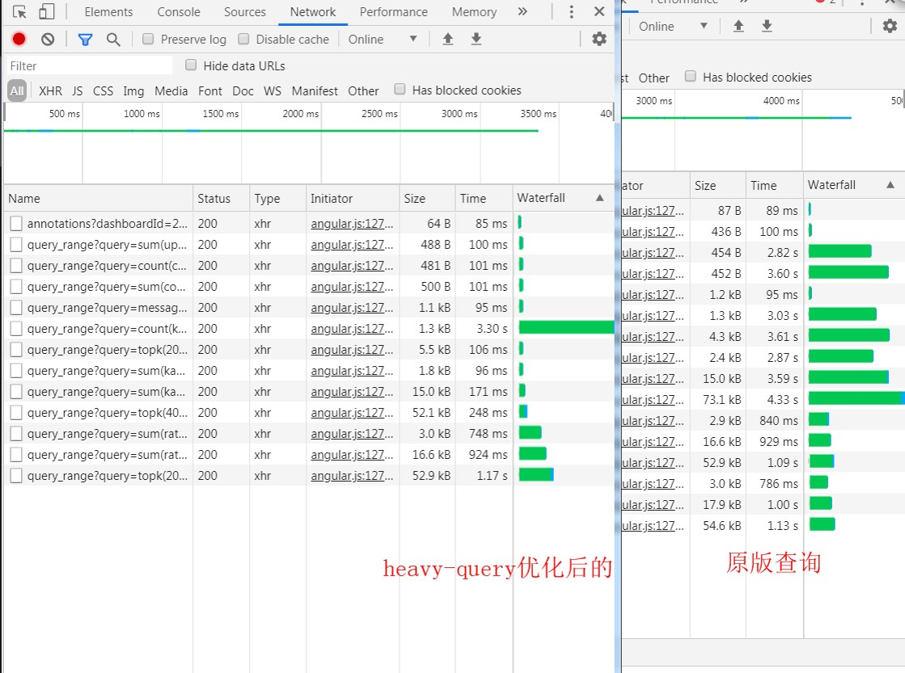
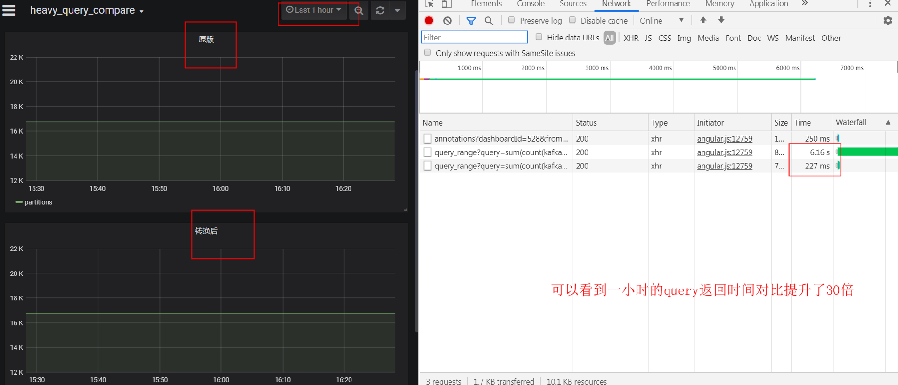
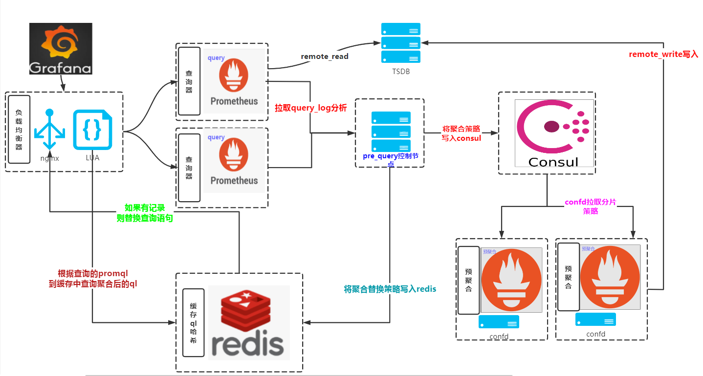

# 本节重点介绍 :
- 需求分析
- 架构设计

# 需求分析
- 使用预聚合提速查询
- 并且降低高基数查询对后端的压力
- 用户无需变更grafana上的查询语句，后端自动替换 
- 效果图

# 架构设计
- 架构图

## 解决方案说明  
- heavy_query对用户侧表现为查询速度慢  
- 在服务端会导致资源占用过多甚至打挂后端存储  
- 查询如果命中heavy_query策略(目前为查询返回时间超过2秒)则会被替换为预先计算好的轻量查询结果返回,两种方式查询的结果一致  
- 未命中的查询按原始查询返回  
- 替换后的metrics_name 会变成 `hke:heavy_expr:xxxx` 字样,而对应的tag不变。对于大分部panel中已经设置了曲线的Legend,所以展示没有区别  
- 现在每晚23:30增量更新heavy_query策略。对于大部分设定好的dashboard没有影响(因为已经存量heavy_query已经跑7天以上了),对于新增策略会从策略生效后开始展示数据,对于查询高峰的白天来说至少保证有10+小时的数据

## 代码架构说明
- parse组件根据prometheus的query log分析heavy_query记录
- 把记录算哈希后增量写入consul，和redis集群中
- prometheus 根据confd拉取属于自己分片的consul数据生成record.yml
- 根据record做预查询聚合写入tsdb
- query前面的lua会将grafana传过来的查询expr算哈希
- 和redis中的记录匹配，匹配中说明这条是heavy_query
- 那么替换其expr到后端查询

# 本节重点总结 :
- 需求分析
- 架构设计