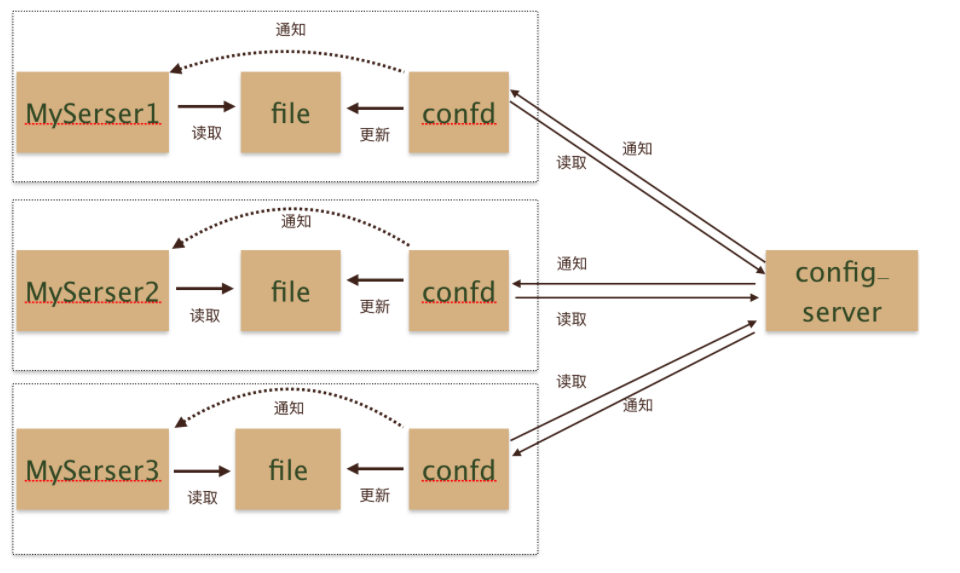
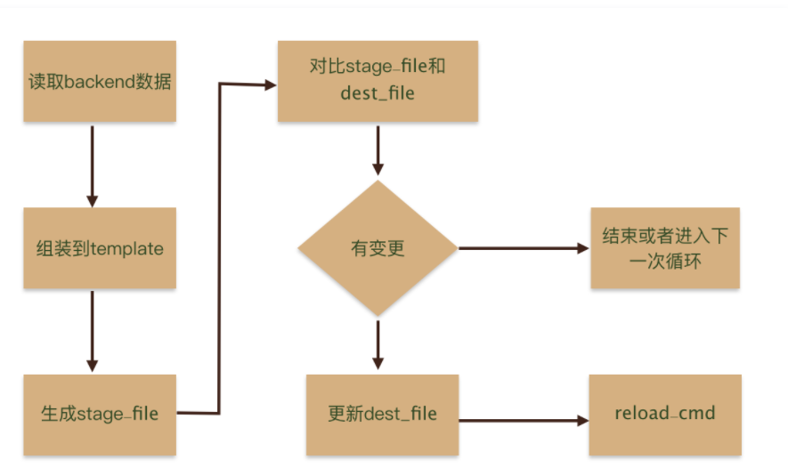

# 本节重点介绍 :
- confd简介
- 修改confd源码增加静态分片功能
- 配置prometheus record的confd

# confd简介
## 简介
- confd，它提供了一种新的集成思路
- confd的存在有点类似于快递员，买了东西不需要自己到店去取货了
- confd这个快递员回把货取过来，然后送到家里，并且通知你货已经送到了
- 加入confd之后的架构大致是这样的：


## confd代码流程



## confd使用
### Template Resources
- 模板源配置文件是TOML格式的文件
- 主要包含配置的生成逻辑，例如模板源，后端存储对应的keys，命令执行等
- 默认目录在/etc/confd/conf.d

> 参数说明：
- 必要参数
    - dest (string) - 写入的目标结果文件
    - keys (array of strings)  kv store中的keys
    - src (string) - 配置模板文件地址
- 可选参数

    - gid (int) - The gid that should own the file. Defaults to the effective gid.
    - mode (string) - The permission mode of the file.
    - uid (int) - The uid that should own the file. Defaults to the effective uid.
    - reload_cmd (string) - The command to reload config.
    - check_cmd (string) - The command to check config. Use {{.src}} to reference the rendered source template.
    - prefix (string) - The string to prefix to keys.
> 举例
- 下面的例子代表 
    - 从kv store中获取 key=/records的值
    - 过滤其中含有/prometheus的
    - 然后调用records.yml.tmpl模板文件
    - 生成/etc/prometheus/rules/record.yml结果文件
    - 最后调用shell 命令reload prometheus  curl -X POST http://localhost:9090/-/reload
- 配置如下
```yaml
[template]
prefix = "/prometheus"
src = "records.yml.tmpl"
dest = "/etc/prometheus/rules/record.yml"
#shards=3
#num=0
keys = [
    "/records"
]
reload_cmd = "curl -X POST http://localhost:9090/-/reload"


```

## confd分片功能
## [代码commit](https://github.com/ning1875/confd/commit/4ae262d0fc299049a6b7152f6628351b3f224f7e)
- 新增resource字段 ,代码位置 D:\go_path\src\github.com\ning1875\confd\resource\template\resource.go
- shards代表分片总数，num代表第几个分片
```go
type TemplateResource struct {
	CheckCmd      string `toml:"check_cmd"`
	Dest          string
	FileMode      os.FileMode
	Gid           int
	Keys          []string
	Mode          string
	Prefix        string
	ReloadCmd     string `toml:"reload_cmd"`
	Shards        int    `toml:"shards"`
	Num           int    `toml:"num"`
	Src           string
	StageFile     *os.File
	Uid           int
	funcMap       map[string]interface{}
	lastIndex     uint64
	keepStageFile bool
	noop          bool
	store         memkv.Store
	storeClient   backends.StoreClient
	syncOnly      bool
	PGPPrivateKey []byte
}

```
- setVar函数增加静态分类逻辑
    - 如果配置了Shards和Num，则认为开启分片
    - key的最后一个/后面就是索引值
    - 根据索引值对shards取模，结果等于Num就keep，否则continue
    - 这样就能打到分片的效果
- 代码
```go
func (t *TemplateResource) setVars() error {

	log.Info("t.shards:%+v,t.nums:%+v", t.Shards, t.Num)
	for k, v := range result {
		if t.Shards+t.Num > 0 {
			s := strings.Split(k, "/")
			numS := s[len(s)-1]
			index, _ := strconv.ParseInt(numS, 10, 32)
			if int(index)%t.Shards != t.Num {
				continue
			}

		}
		log.Debug("t.shards:%+v,t.nums:%+v,get key:%+v,value:%+v", t.Shards, t.Num, k, v)
		t.store.Set(path.Join("/", strings.TrimPrefix(k, t.Prefix)), v)
	}
	return nil
}
```

## confd分片功能后的配置

- 创建目录
```shell script
mkdir -p /etc/confd/{conf.d,templates}
```
-  主配置文件/etc/confd/conf.d/records.yml.toml

```shell script
cat <<-"EOF"  > /etc/confd/conf.d/records.yml.toml
[template] 
prefix = "/prometheus"
src = "records.yml.tmpl"
dest = "/etc/prometheus/rules/record.yml"
#shards=3
#num=0
keys = [
    "/records"
]
reload_cmd = "curl -X POST http://localhost:9090/-/reload"


EOF
```
- shards代表分片总数，num代表第几个分片
- record模板文件 /etc/confd/templates/records.yml.tmpl
```shell script
cat <<-"EOF"  > /etc/confd/templates/records.yml.tmpl
groups:
- name: my_record
  interval: 30s
  rules:{{range gets "/records/*"}}{{$item := json .Value}}
  - record: {{$item.record}}
    expr: {{$item.expr}}{{end}}
EOF

```


## 指定consul backend 启动confd
- onetime代表运行一次
```shell script
confd -onetime --backend consul --node localhost:8500 --log-level debug
```

```shell script
cat <<EOF>  /etc/systemd/system/confd.service
[Unit]
Description=confd server
Wants=network-online.target
After=network-online.target

[Service]
ExecStart=/usr/bin/confd  --backend consul --node localhost:8500 --log-level debug
StandardOutput=syslog
StandardError=syslog
SyslogIdentifier=confd
[Install]
WantedBy=default.target
EOF

# 启动服务
systemctl daemon-reload && systemctl start confd   

systemctl status confd 

```


# 本节重点总结 :
- confd简介
- 修改confd源码增加静态分片功能
- 配置prometheus record的confd
