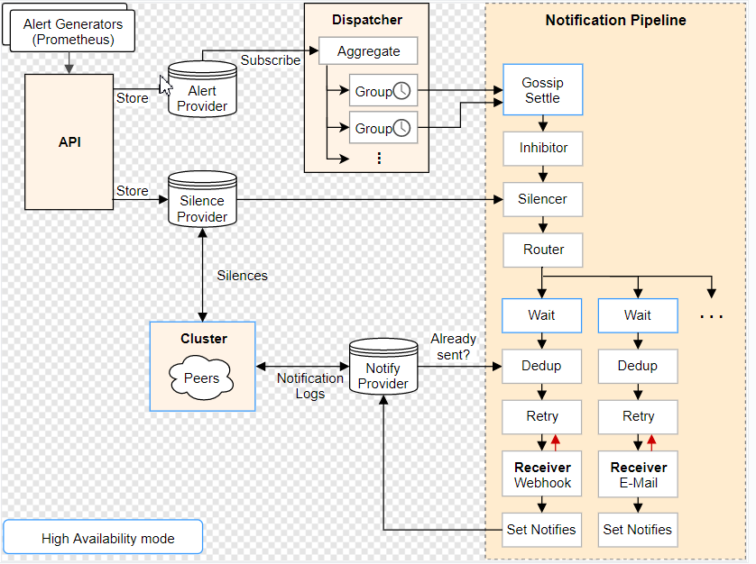
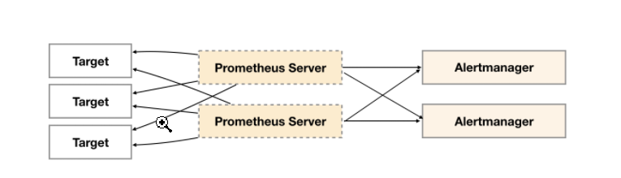

# 本节重点介绍 :
- alertmanager 单点问题
- alertmanager 引入gossip协议来同步节点间的信息
- 配置alertmanager 高可用并测试


# 简介

## 项目地址
- https://prometheus.io/docs/alerting/latest/alertmanager/


## alertmanager 架构图



## 文档地址
- https://prometheus.io/docs/alerting/latest/alertmanager/
- Alertmanager处理由诸如Prometheus服务器之类的客户端应用程序发送的警报

## 核心功能点

|  英文   | 中文 | 含义  | 
|  ----  | ----  | ---- | 
| deduplicating	| 重复数据删除 |	prometheus产生同一条报警<br>发送给多个alm去重后发送  |  
| grouping	| 分组  |	告警可以分组处理，同一个组里共享等待时长等参数<br>可以做告警聚合 |  
| route	| 路由  |路由匹配树，可以理解为告警订阅 |  
| silencing 	| 静默  | 灵活的告警静默，如按tag | 
| inhibition  	| 抑制  | 如果某些其他警报已经触发，则抑制某些警报的通知 <br>如机器down，上面的进程down告警不触发| 
| HA  	| 高可用性  | gossip实现 | 
 
 

# alertmanager 单点问题
- 部署一个肯定是单点

> 尝试部署多个独立的alertmanager
-  prometheus产生的报警并行发往多个alm
 
- 此方案能保证告警信息不会因为单个alm挂掉儿接收不到
- 但是会造成同一条告警信息发送多次，告警重复


## alertmanager 引入gossip协议来同步节点间的信息
 
**信息种类如下**
- 新接收到的告警信息
    - 通知发送状态同步：告警通知发送完成后，基于Push-based同步告警发送状态。Wait阶段可以确保集群状态一致
- silence静默信息
- 查看代码可以知道共有两个地方被`SetBroadcast`
    - 即动态接受数据的地方可以gossip，配置如inhibit、route则不可以
- 调用gossip的地方

 
# 回味alertmanager 架构图


# 高可用部署
- 其余节点启动参数加上对端ip即可
```shell script
ExecStart=/opt/app/alertmanager/alertmanager  --config.file=/opt/app/alertmanager/alertmanager.yml --storage.path=/opt/app/alertmanager/data/ --cluster.peer=192.168.43.114:9094 
```
## 测试gossip方法
- 在一个节点创建静默
- 在其他点页面上能看到静默的记录


## 调api发送告警，测试dedupe
> step1：gossip启动两个alertm，配置保持一致

> step2：调两个alertm地址发送同一条告警
- 细节
    - 可以在第二个节点不启动接收端
    - 所以当日志中没出现 connection refused说明 第二个节点没有发送告警
    - 达到我们用gossip 去掉重复告警的目的
    - 其实是第一个节点发送告警后  gossip通知了第二个节点
- 文档地址 https://prometheus.io/docs/alerting/latest/clients/
```yaml
[
  {
    "labels": {
      "alertname": "<requiredAlertName>",
      "<labelname>": "<labelvalue>",
      ...
    },
    "annotations": {
      "<labelname>": "<labelvalue>",
    },
    "startsAt": "<rfc3339>",
    "endsAt": "<rfc3339>",
    "generatorURL": "<generator_url>"
  },
  ...
]
```

> step3: 查看接收端收到几条


# 本节重点总结 :
- alertmanager 单点问题
- alertmanager 引入gossip协议来同步节点间的信息
- 配置alertmanager 高可用并测试